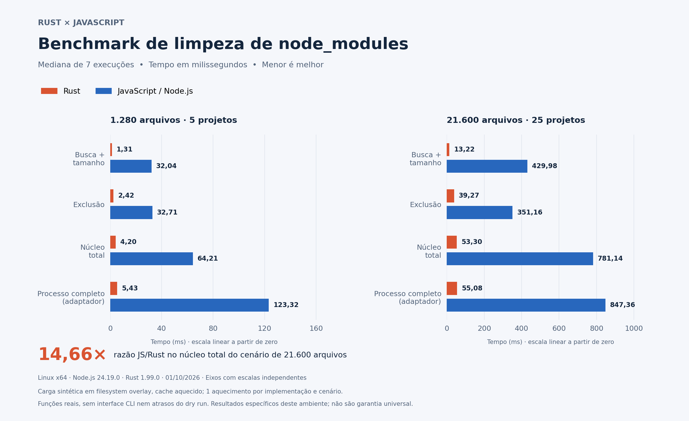

# Rust Node Modules Cleanup

CLI em Rust para encontrar pastas `node_modules`, mostrar seus tamanhos e removê-las em lote com confirmação.

Reimplementação inspirada em [sebastianekstrom/node-modules-cleanup](https://github.com/sebastianekstrom/node-modules-cleanup). Executável nativo, sem Node.js, Bun ou dependências Cargo externas.

## Instalação

Requer Rust e Cargo **1.85 ou superior** para compilar. Depois de compilado, o executável não requer Rust instalado.

```bash
git clone https://github.com/mdnbras/rust-node-modules-cleanup.git
cd rust-node-modules-cleanup
cargo install --path . --locked
```

Se o repositório for privado, autentique seu Git antes de clonar. O pacote não foi publicado no crates.io.

## Uso

```bash
# Inspecionar sem apagar nem solicitar confirmação
rust-node-modules-cleanup ~/projects --dry

# Listar tamanhos e pedir confirmação antes de excluir
rust-node-modules-cleanup ~/projects

# Excluir todas as pastas encontradas sem confirmação
rust-node-modules-cleanup ~/projects --skip-confirmation

# Limitar operações simultâneas
rust-node-modules-cleanup ~/projects --jobs 2 --dry

# Caminhos com espaços
rust-node-modules-cleanup "/home/user/my projects" --dry
```

Windows (PowerShell):

```powershell
rust-node-modules-cleanup.exe "C:\Users\seu-usuario\projects" --dry
```

| Argumento | Comportamento |
| --- | --- |
| `<path>` | Diretório obrigatório, relativo ou absoluto |
| `--dry`, `--dry-run` | Apenas listar; tem precedência sobre `-y` |
| `--skip-confirmation`, `-y` | Excluir sem perguntar |
| `--jobs N` | De 1 a 64 operações simultâneas; padrão 5 |
| `--help`, `-h`, `--h` | Ajuda |
| `--version`, `-V`, `--v` | Versão |
| `--` | Encerrar opções, permitindo caminhos iniciados por hífen |

A busca ignora subdiretórios cujo nome começa com ponto e não entra em uma pasta `node_modules` já identificada. Pastas ocultas e dependências aninhadas **dentro** dela entram no cálculo de tamanho e na exclusão. Também é possível informar uma pasta `node_modules` diretamente.

A confirmação aceita `y`, `yes`, `s` e `sim`, sem diferenciar maiúsculas; mantém ainda a resposta especial do original, `kör bara kör!`. Enter, EOF ou qualquer outra resposta cancela. Exclusão é permanente, sem lixeira; execute `npm install`, `npm ci` ou o gerenciador do projeto para restaurar as dependências.

## Segurança e limites

- Links simbólicos e, no Windows, junctions/reparse points não são percorridos. Links internos são removidos junto com a pasta; os destinos não são contabilizados nem apagados por seguimento de links.
- Antes da exclusão, o caminho é revalidado quanto ao nome, escopo, resolução canônica e identidade do diretório (device/inode no Unix; criação no Windows).
- Pare instalações, builds e processos que alterem a árvore durante a operação. As verificações reduzem riscos, mas não constituem uma sandbox contra alterações concorrentes maliciosas; existe intervalo entre verificação e remoção.
- Erros de leitura geram avisos. Uma busca parcial pode continuar com as pastas encontradas, mas termina com código 1. Falhas de exclusão não impedem as demais tentativas e não entram no contador de pastas removidas.
- O tamanho é a soma dos bytes lógicos dos arquivos regulares, não uma medida exata de espaço físico liberado: hard links, compressão, arquivos esparsos e alterações concorrentes podem mudar o resultado.
- Há um [benchmark reproduzível](benchmarks/README.md) com amostras e metodologia. Os resultados são específicos do ambiente e da carga sintética; não representam uma garantia universal de desempenho.

| Código de saída | Significado |
| --- | --- |
| `0` | Operação completa, dry run, cancelamento ou busca completa sem resultados |
| `1` | Argumentos inválidos, falha de acesso/exclusão ou busca/tamanho incompleto |

## Desenvolvimento

```bash
cargo fmt --check
cargo test --locked
cargo clippy --all-targets --locked -- -D warnings
cargo build --release --locked
cargo run -- ./algum-diretorio --dry
```

Binário local: `target/release/rust-node-modules-cleanup` (sufixo `.exe` no Windows).

O GitHub Actions executa formatação, Clippy, testes e build em Linux, Windows e macOS, além de verificar o Rust mínimo no Linux. Os executáveis de CI ficam nos artifacts do workflow. A publicação dos pacotes é feita pelo workflow `Release binaries`, descrito abaixo.


## Executáveis nas releases

Ao **publicar uma release** (incluindo pré-release), o workflow `.github/workflows/release.yml` testa e compila o código da tag e anexa:

| Plataforma | Arquitetura / target | Pacote |
| --- | --- | --- |
| Linux | x86_64-unknown-linux-gnu | `.tar.gz` |
| macOS Intel | x86_64-apple-darwin | `.tar.gz` |
| macOS Apple Silicon | aarch64-apple-darwin | `.tar.gz` |
| Windows | x86_64-pc-windows-msvc | `.zip` |

Os nomes seguem `rust-node-modules-cleanup-<target>` e os pacotes incluem executável, README e licenças. O arquivo `SHA256SUMS` contém os hashes dos quatro pacotes. Linux é compilado no Ubuntu 22.04 (glibc 2.35 ou compatível); macOS usa runners macOS 15. Os binários não recebem assinatura de distribuição ou notarização.

Para publicar:

1. Atualize a versão em `Cargo.toml` e `Cargo.lock` e envie o commit para `master`.
2. Abra **Releases → Draft a new release**, crie uma tag como `v0.1.0` no commit que contém este workflow e clique em **Publish release**.
3. Acompanhe **Actions → Release binaries**. Após os quatro builds passarem, os pacotes e checksums aparecerão em **Assets** da release.

Salvar somente um rascunho ou criar somente uma tag não dispara a publicação. O workflow usa o `GITHUB_TOKEN` automático, com `contents: write` apenas no job de upload; não exige um secret pessoal.

Também é possível usar **Run workflow** para validar os builds e baixar artifacts sem criar nem alterar releases. Alterações no workflow ou no script de empacotamento disparam essa mesma validação automaticamente. Em uma reexecução de release, assets de mesmo nome são substituídos (`--clobber`). O upload pressupõe que a release permita adicionar/alterar assets; releases imutáveis exigem anexar arquivos antes da publicação.

Para instalar, baixe o pacote do seu sistema na página de releases, extraia e coloque o executável em uma pasta do `PATH`. Não é necessário instalar Rust para usar esses binários.

## Benchmark comparativo



Medianas de **7 execuções** por implementação, após 1 aquecimento, medidas em Linux x64 em 01/10/2026. Tempos em milissegundos; **menor é melhor**.

| Cenário | Etapa | Rust (ms) | JavaScript (ms) | Razão JS/Rust |
| --- | --- | ---: | ---: | ---: |
| 1.280 arquivos | Busca + tamanho | 1,31 | 32,04 | 24,55× |
| 1.280 arquivos | Exclusão | 2,42 | 32,71 | 13,51× |
| 1.280 arquivos | Núcleo total | 4,20 | 64,21 | 15,28× |
| 1.280 arquivos | Processo completo (adaptador) | 5,43 | 123,32 | 22,71× |
| 21.600 arquivos | Busca + tamanho | 13,22 | 429,98 | 32,52× |
| 21.600 arquivos | Exclusão | 39,27 | 351,16 | 8,94× |
| 21.600 arquivos | Núcleo total | 53,30 | 781,14 | 14,66× |
| 21.600 arquivos | Processo completo (adaptador) | 55,08 | 847,36 | 15,38× |

No cenário de 21.600 arquivos, a razão das medianas do núcleo total foi **14,66× a favor de Rust**. O núcleo total é medido por execução; sua mediana não precisa ser a soma das medianas das etapas.

**Condições:** carga sintética, arquivos recém-criados em filesystem overlay e cache aquecido, Node.js 24.19.0 e Rust 1.99.0. São comparadas funções reais com a concorrência padrão de cada implementação; o processo completo inclui os adaptadores, não a interface dos CLIs. Os resultados são específicos deste ambiente. O gráfico usa escalas independentes entre cenários; a dispersão e as amostras estão no relatório abaixo.

O benchmark compara as funções reais do projeto JavaScript original com a implementação Rust, usando fixtures equivalentes, aquecimento, ordem alternada e múltiplas execuções. Mede busca + tamanho, exclusão e tempo total; não inclui os atrasos artificiais do `--dry` original.

- [Como executar e metodologia](benchmarks/README.md)
- [Resultado Linux de 01/10/2026](docs/benchmarks/2026-10-01-linux.md)
- [Amostras brutas em JSON](docs/benchmarks/2026-10-01-linux.json)
- GitHub Actions: **Benchmark Rust vs JavaScript → Run workflow**.

## Estrutura

- `src/cli.rs`: argumentos e confirmação.
- `src/scan.rs`: descoberta, tamanho, validação e exclusão.
- `src/main.rs`: interface de terminal, execução concorrente e resumo.
- `tests/cleanup.rs`: testes com árvores temporárias e invocação do executável real.
- [docs/ANALISE.md](docs/ANALISE.md): análise do projeto original e decisões da migração.

## Licença e créditos

MIT. Projeto original de Sebastian Ekström; sua licença está preservada em [LICENSE-UPSTREAM](LICENSE-UPSTREAM). Esta versão mantém o objetivo e as opções principais, com diferenças documentadas, sem reproduzir a apresentação visual do CLI original.
